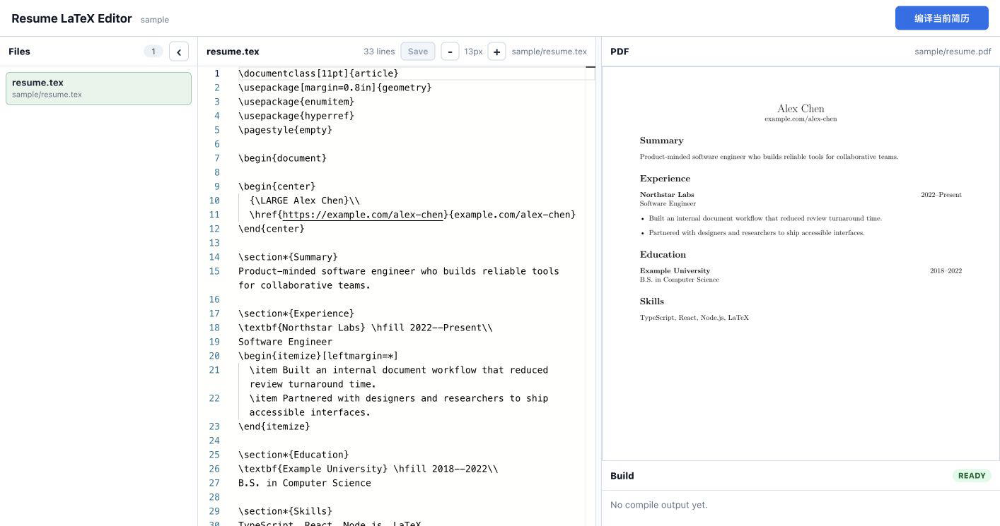
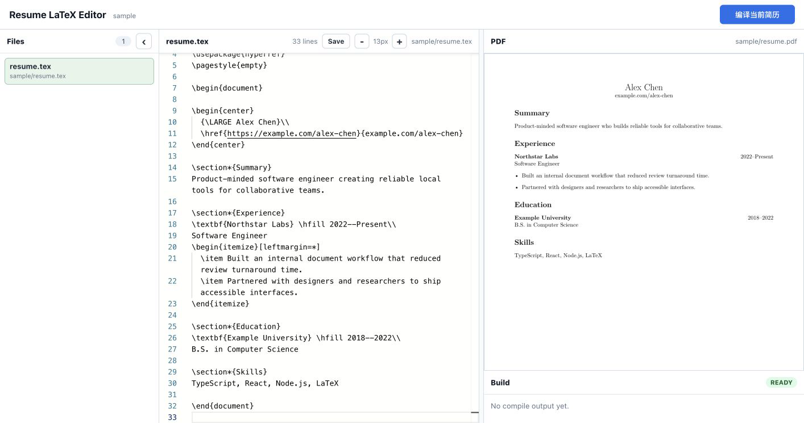
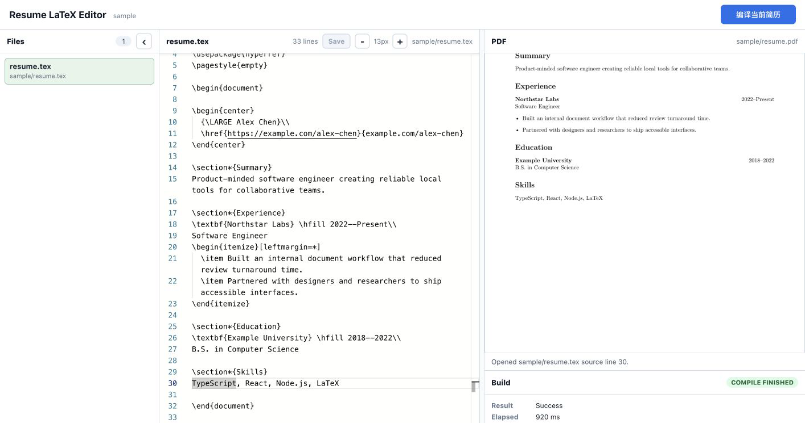

# Resume LaTeX Editor

[English](README.md)

一个本地运行、隐私优先的 LaTeX 简历工作区。源码始终保留在你的机器上；应用只会
在已配置的可信根目录内发现简历，并把文件树、Monaco 编辑器、PDF 预览、编译输出
和 SyncTeX 定位整合在一个专注的界面中。

> 此应用仅绑定回环地址且不提供身份验证。请保持本地运行，并且只打开可信的
> LaTeX 项目。

## 使用流程

### 加载虚构示例



默认项目会直接打开 `examples/sample/resume.tex`，不需要任何个人数据。

### 编辑并显式保存



草稿会一直保留在编辑器内，直到你选择 **Save**。如果带着未保存草稿编译，应用会
先保存当前草稿。

### 编译并从 PDF 跳转到源码



使用 XeLaTeX 编译后，点击渲染的 PDF，即可通过 SyncTeX 跳到对应源码行。

## 功能

- 在一个可信根目录内发现简历入口文件和 `.tex` 源文件。
- 使用 Monaco 编辑，支持字号调整、显式保存和未保存草稿保护。
- 用 XeLaTeX 编译选中的简历，并显示经过脱敏的编译输出。
- 响应式、高像素密度地预览 PDF 第一页。
- 通过 SyncTeX 将 PDF 点击位置映射回源码。
- 流式 AI 助手：可以看到当前 TeX 源码，调用 DeepSeek（`deepseek-v4-flash`）
  修改简历，修改结果先应用到编辑器、确认后再保存。
- 限制文件访问、验证请求、约束进程输出，并使用不泄露本地绝对路径的稳定公开错误。
- 提供虚构示例、自动隐私扫描、测试和生产构建。

## 环境要求

- Node.js `22.13.0` 或更高版本（测试覆盖 Node 22 和 24）以及 npm。
- `PATH` 中可用 XeLaTeX 和 SyncTeX。
  - macOS：安装 MacTeX 或 BasicTeX，并确保 `/Library/TeX/texbin` 位于
    `PATH`。
  - Linux：安装包含 XeLaTeX、SyncTeX 以及简历所需 LaTeX 宏包的 TeX Live
    发行版。
  - Windows：安装 MiKTeX 或 TeX Live，按需启用宏包安装，并把其二进制目录
    加入 `PATH`。

## 使用示例快速开始

```sh
git clone git@github.com:yihan35/resume_latex.git
cd resume_latex
npm ci
npm run dev
```

打开 `http://127.0.0.1:5173`。API 运行在
`http://127.0.0.1:43871`，虚构示例会自动加载。

生产构建方式：

```sh
npm run build
npm start
```

然后打开 `http://127.0.0.1:43871`。

## 配置

服务端启动时会读取进程环境变量和可选且已忽略的 `.env.local` 文件。可以把
`.env.example` 复制为 `.env.local`，也可以在 shell 中设置相同的值。

| 设置                        | 默认值                         | 用途                           |
| --------------------------- | ------------------------------ | ------------------------------ |
| `RESUME_PROJECT_ROOT`       | `./examples`                   | 包含各简历目录的可信根目录     |
| `RESUME_ENTRY_FILES`        | `resume.tex,main.tex,简历.tex` | 以逗号分隔的入口文件发现优先级 |
| `RESUME_EDITOR_PORT`        | `43871`                        | 生产环境及 API 服务端口        |
| `RESUME_EDITOR_CLIENT_PORT` | `5173`                         | Vite 开发服务器端口            |
| `RESUME_LATEX_COMMAND`      | `xelatex`                      | XeLaTeX 可执行文件名或绝对路径 |
| `RESUME_SYNCTEX_COMMAND`    | `synctex`                      | SyncTeX 可执行文件名或绝对路径 |
| `DEEPSEEK_API_KEY`          | _（未设置）_                   | DeepSeek API Key，启用 AI 助手 |
| `DEEPSEEK_MODEL`            | `deepseek-v4-flash`            | 发送给 DeepSeek 的模型名       |
| `DEEPSEEK_BASE_URL`         | `https://api.deepseek.com`     | DeepSeek API 基础地址          |
| `DEEPSEEK_TIMEOUT_MS`       | `120000`                       | AI 上游请求超时时间（毫秒）    |

相对项目根目录会基于仓库目录解析。非法端口、不存在或并非目录的根路径，以及
空入口文件列表都会让应用以简明错误停止启动。

## AI 助手

AI 助手默认关闭，配置后才启用。在 `.env.local`（已被 git 忽略）中设置
`DEEPSEEK_API_KEY`，打开应用后点击顶栏的 **AI 助手**。

- 发送消息会把当前编辑器内容（含未保存草稿）和对话历史发送到 DeepSeek。
  界面会先显示隐私提示；确认前无法发送。
- 回复以流式方式显示。当模型返回完整 ` ```latex ` 代码块时，会出现
  **应用到编辑器** 按钮，把提取出的内容写入编辑器草稿。请检查后再点保存；
  不会自动覆盖磁盘文件。
- API Key 只存在于服务端。未配置 key 时面板显示 AI 未配置，其余功能不受影响。
- 对话历史仅保存在内存中，刷新页面后清空。

## 开发

```sh
npm run dev             # API 与 Vite 开发服务器
npm run typecheck       # 服务端与客户端 TypeScript 检查
npm test                # 完整 Vitest 测试套件
npm run test:coverage   # 使用 V8 覆盖率运行测试
npm run format:check    # Prettier 检查
npm run lint            # ESLint 检查
npm run privacy:check   # 检查已跟踪及准备公开的未跟踪文件
npm run check           # 所有发布门禁检查及生产构建
npm run build           # 服务端与客户端生产构建
npm start               # 在 API 端口提供已构建应用
```

迭代时可只运行一个测试文件：

```sh
npx vitest run scripts/privacy-check.test.ts
```

## 架构

```text
client/src/
  app/                  应用外壳与错误边界
  components/           文件、编辑器、预览和编译面板
  features/editor/      Monaco 集成
  features/preview/     PDF.js 第一页渲染
  features/workspace/   reducer、selectors 与异步编排
  lib/                   类型化 API 客户端
server/src/
  config/                环境解析与验证
  domain/                发现、文件安全、编译与 SyncTeX
  http/                  Express 路由、验证与公开错误
  process/               有界子进程执行
shared/                  客户端/服务端 HTTP 契约
examples/sample/         默认虚构简历
scripts/                 隐私自动化
```

浏览器调用类型化 Express 路由。服务端路由根据当前发现结果解析标识符，领域服务
执行可信根目录边界，配置好的本地可执行程序完成编译和 SyncTeX 查询。

## 安全模型

- 服务端只监听 `127.0.0.1`，并且有意不提供身份验证。
- `RESUME_PROJECT_ROOT` 是可信边界；不要加载不可信的 TeX。
- 文件操作只接受安全的相对 `.tex` 路径，并拒绝路径逃逸、符号链接替换、异常请求
  和过大的请求体。
- 编译、PDF 和 SyncTeX 请求使用已发现的简历标识符，而不是客户端提供的命令或
  绝对路径。
- 编译器输出和公开错误在到达浏览器前都会受限并脱敏。

这些措施为单用户本地工具提供纵深防御，但并不是针对恶意文档的沙箱。报告方式和
支持版本请参阅 [SECURITY.md](SECURITY.md)。

## 当前限制

预览有意只渲染第 1 页，PDF 到源码的查询也只发送第 1 页坐标；目前尚未实现多页
导航。

## 问题排查

- **没有显示简历：** 确认可信根目录存在，并且其子目录中包含一个已配置的入口
  文件名。
- **XeLaTeX 或 SyncTeX 不可用：** 运行 `xelatex --version` 和
  `synctex --version`，或设置对应的命令变量。
- **缺少 TeX 宏包：** 通过你的 TeX 发行版安装宏包，然后重新编译。
- **端口被占用：** 启动前修改 `RESUME_EDITOR_PORT` 或
  `RESUME_EDITOR_CLIENT_PORT`。
- **PDF 缺失或未更新：** 保存、编译并检查 Build 面板。编译使用 `-synctex=1`，
  因此源码定位依赖成功编译。
- **生产页面无法加载：** 在 `npm start` 前运行 `npm run build`。

## 项目治理

欢迎贡献。请阅读 [CONTRIBUTING.md](CONTRIBUTING.md)、
[行为准则](CODE_OF_CONDUCT.md)、[安全策略](SECURITY.md)和
[更新日志](CHANGELOG.md)。

## 许可证

项目使用 [MIT License](LICENSE) 发布，并基于 React、Monaco Editor、PDF.js、
Express、Vite 与本地 TeX 工具链构建。
